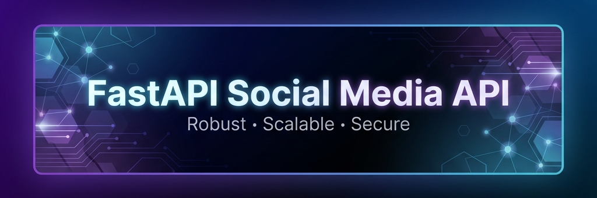

<!-- Cover Photo -->
<div align="center">
  
</div>

<!-- Profile Info Section -->
<div align="center">
  
  
  <h1>FastAPI Social Media API </h1>
  <p style="color: #888;">@FastAPISocial • <b>Backend Developer</b> • Joined December 2025</p>

  <p>
    Building connections with code. 🚀<br/>
    Robust • Scalable • Secure • Real-time Voting System<br/>
    📍 Localhost:8000 &nbsp; 🔗 <a href="http://127.0.0.1:8000/docs">docs.api.social</a>
  </p>

  <!-- Action Buttons -->
  <a href="https://github.com/UllasDas004/FastAPI-Social-Media-API/stargazers">
    
  </a>
  <a href="https://github.com/ullas-das/FastAPI-Social-Media-API/issues">
    
  </a>
  <a href="https://www.linkedin.com/in/ullas-das/">
    
  </a>
</div>

<br />

<!-- Stats Bar -->
<div align="center">
  <table border="0">
    <tr>
      <td align="center"><b>3.9+</b><br/></td>
      <td width="20"></td>
      <td align="center"><b>0.95+</b><br/></td>
      <td width="20"></td>
      <td align="center"><b>100%</b><br/><span style="color:#888; font-size:12px">Uptime</span></td>
      <td width="20"></td>
    </tr>
  </table>
</div>

<hr />

<!-- The Feed -->
## 📰 The Feed

### 📌 Pinned Post
> **FastAPI Social** @FastAPISocial · *Just now* <br>
> We just shipped some major updates! Check out the full feature list below. 👇 #shipit #python #backend
>
> | **Feature** | **Description** |
> | :--- | :--- |
> | 🔐 **Secure Login** | JWT Authentication with secure password hashing. |
> | 👍 **Voting System** | Like & Vote on posts in real-time. |
> | 📝 **CRUD Posts** | Create, Read, Update, and Delete your content. |
> | 🏥 **Health Check** | System status monitoring endpoint. |

<br />

### ⚡ Quick Start Action
> **System** @RootUser · *Sponsored* <br>
> Ready to launch your own instance? 🚀 Tap below to reveal the full deployment guide.
>
> <details>
> <summary><strong>🔽 Install App (Click to Expand)</strong></summary>
> <br />
>
> **Step 1: Acquire the Codebase**
> <br />
> Clone the repository to your local machine to get started.
> ```bash
> git clone https://github.com/UllasDas004/FastAPI-Social-Media-API.git
> cd FastAPI-Social-Media-API
> ```
>
> **Step 2: Prepare the Environment**
> <br />
> We recommend using a virtual environment to keep your dependencies isolated and clean.
> ```bash
> # Create the virtual environment
> python -m venv venv
>
> # Activate the environment
> # 🪟 Windows:
> .\venv\Scripts\activate
> # 🍎 Mac / 🐧 Linux:
> source venv/bin/activate
> ```
>
> **Step 3: Install Dependencies**
> <br />
> Install all necessary Python packages as listed in `requirements.txt`.
> ```bash
> pip install -r requirements.txt
> ```
>
> **Step 4: Configure Environment Variables**
> <br />
> Security first! Create a `.env` file in the root directory. You must define your database credentials and secret keys here.
> *Refer to `app/config.py` for the schema.*
>
> **Step 5: Launch the API**
> <br />
> Start the Uvicorn server in development mode.
> ```bash
> uvicorn app.main:app --reload
> ```
> The API will go live at `http://127.0.0.1:8000`.
> </details>

<br />

### 📸 My Stack (Tech Stories)
> **FastAPI Social** @FastAPISocial · *2h* <br>
> The tools that make it all happen. 🛠️ #stack #dev
>
> <div align="center">
>   
>   
>   
>   
> </div>

<br />

### ⏳ The Evolution
> **FastAPI Social** @FastAPISocial · *5d ago* <br>
> 📊 **Data Insights Unlocked!** <br>
> Just implemented aggregation! Now you can see exactly how many votes a post has. The SQL joins were tricky but SQLAlchemy handled it like a champ. 🏆 #data #analytics #sql
>
> *`SELECT posts.*, COUNT(votes.post_id) as votes FROM posts...`*

<br />

> **FastAPI Social** @FastAPISocial · *1w ago* <br>
> 👍👎 **The People Have Spoken!** <br>
> Real-time voting is live! Smart logic handles the actions:
> *   **Vote (Dir=1):** Adds your like. ➕ (If already liked -> 🚫 Forbidden/Conflict)
> *   **Unvote (Dir=0):** Removes your like. ➖ (If not liked yet -> 🚫 Forbidden/Error)
> No double-voting allowed here! 🙅‍♂️ #interactive #logic

<br />

> **FastAPI Social** @FastAPISocial · *2w ago* <br>
> 🔍 **Lost in the Noise? Not anymore.** <br>
> Just added **Pagination & Searching**! You can now filter posts by keyword (`?search=xyz`) and control results with Limit & Offset.
> No more loading the entire database at once! ⚡ #optimization #filtering #pagination

<br />

> **FastAPI Social** @FastAPISocial · *2w ago* <br>
> 🔗 **Building Relationships** <br>
> It's official: Users and Posts are now connected. Using Foreign Keys to ensure every post belongs to a valid user. No more orphan data! 👨‍👩‍👧‍👦 #relationaldb #postgres

<br />

> **FastAPI Social** @FastAPISocial · *3w ago* <br>
> 🔐 **Security First** <br>
> Added the `Users` table and fully secured the API. Password hashing with **Argon2**? Check. JWT tokens? Check. Your data is safe with us. 🕵️‍♂️ #security #auth

<br />

> **FastAPI Social** @FastAPISocial · *1mo ago* <br>
> 🐍 **Controlling the beast** <br>
> Moved from raw SQL to **SQLAlchemy ORM**. Managing the database with pure Python code feels like a superpower. 🦸‍♂️ Models defined, schemas ready. #orm #productivity

<br />

> **FastAPI Social** @FastAPISocial · *1mo ago* <br>
> 🛡️ **You Shall Not Pass!** <br>
> Just learned **Pydantic**. The data validation is insane. If the data doesn't match the schema, it doesn't get in. Clean data only. 🧼 #clean #validation

<br />

> **FastAPI Social** @FastAPISocial · *2mo ago* <br>
> 🌱 **Hello World!** <br>
> Just started a new journey. The stack: **FastAPI**, **PostgreSQL**, and **Postman** for testing. Let's see where this goes. 🚀 #dayone #coding

<br />

### 🚧 Status Update
> **FastAPI Social** @FastAPISocial · *Pinned Bottom* <br>
> ⚠️ **Under Construction:** This project is currently in **Active Development**! 🏗️ <br>
> I'm constantly adding new things. The timeline above is just the beginning. Watch this space! 👀 #WIP #buildinginpublic
> 
> 

<br />

---

<!-- Footer -->
<div align="center">
  <p>© 2025 FastAPI Social Media API • <a href="#">Terms</a> • <a href="#">Privacy</a> • <a href="#">Docs</a></p>
</div>
